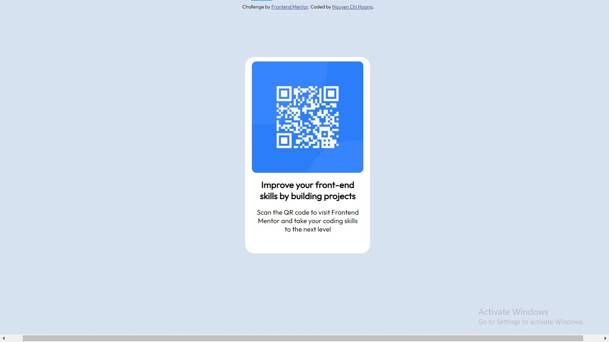

## Table of contents

- [Overview](#overview)
  - [Screenshot](#screenshot)
  - [Links](#links)
- [My process](#my-process)
  - [Built with](#built-with)
  - [What I learned](#what-i-learned)
- [Author](#author)

## Overview

### Screenshot



### Links

- Solution URL: [Add solution URL here](https://your-solution-url.com)
- Live Site URL: [Add live site URL here](https://your-live-site-url.com)

## My process

### Built with

- Semantic HTML5 markup
- CSS custom properties
- [Styled Components](https://styled-components.com/) - For styles

### What I learned

```html
<div class="main">
    
    <div class="title">
        Improve your front-end skills by building projects
    </div>
    <p>Scan the QR code to visit Frontend Mentor and take your coding skills to the next level</p>
</div>
```
```css
body {
    width: 1440px;
    background-color: hsl(212, 45%, 89%);
    font-size: 15px;
    font-family: 'Outfit', sans-serif;
}

.main {
    position: absolute;
    left: 43%;
    top: 17%;
    border-radius: 20px;
    text-align: center ;
    width: 280px;
    background-color: hsl(0, 0%, 100%);
}

.main img {
    border-radius: 20px;
    width: 250px;
    padding: 10px;
}

.main .title {
    font-weight: 700;
    font-size: 20px;
    padding: 0 20px;
}

p {
    font-weight: 400;
    padding: 0 20px 30px 20px;
}
```
```js
```

## Author

- Website - [Add your name here](https://www.your-site.com)
- Frontend Mentor - [@yourusername](https://www.frontendmentor.io/profile/yourusername)
- Twitter - [@yourusername](https://www.twitter.com/yourusername)

**Note: Delete this note and add/remove/edit lines above based on what links you'd like to share.**